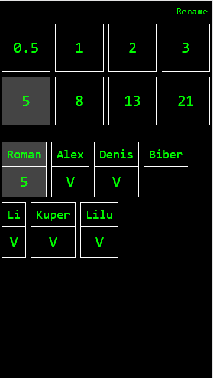

# Scrum poker (fibonacci)

Work on Node.js with WebSocket

#### Get start for local use:
```
yarn
node server
yarn run serve
```

Check this out it http://localhost:9011/

#### For production build
```
npm i
node server
npm run build
```
Run index.html from /dist

Enjoy!

By default, nobody sees scores, until everybody makes choose!




